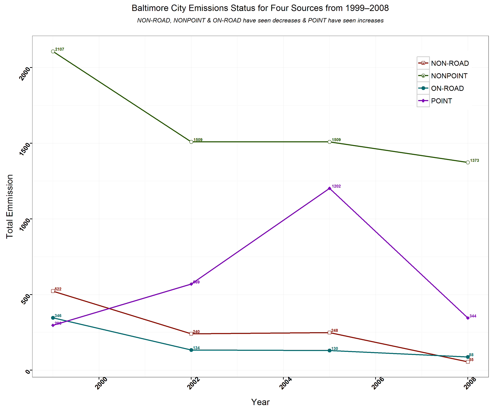
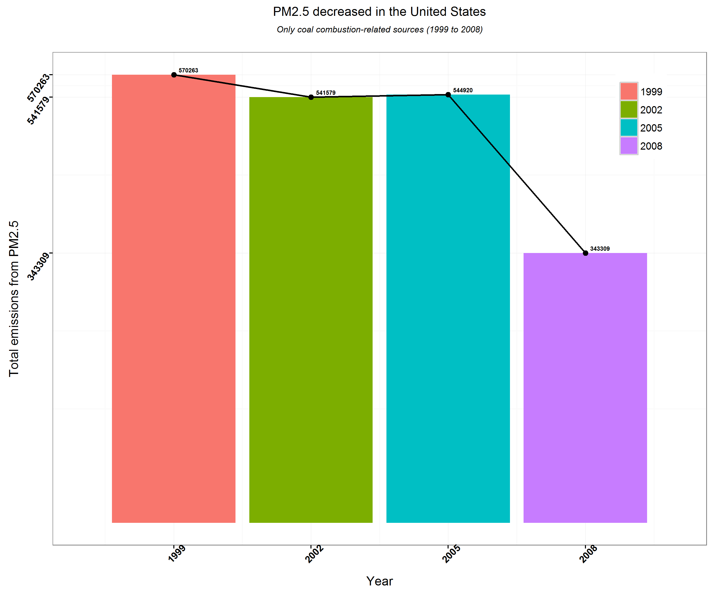
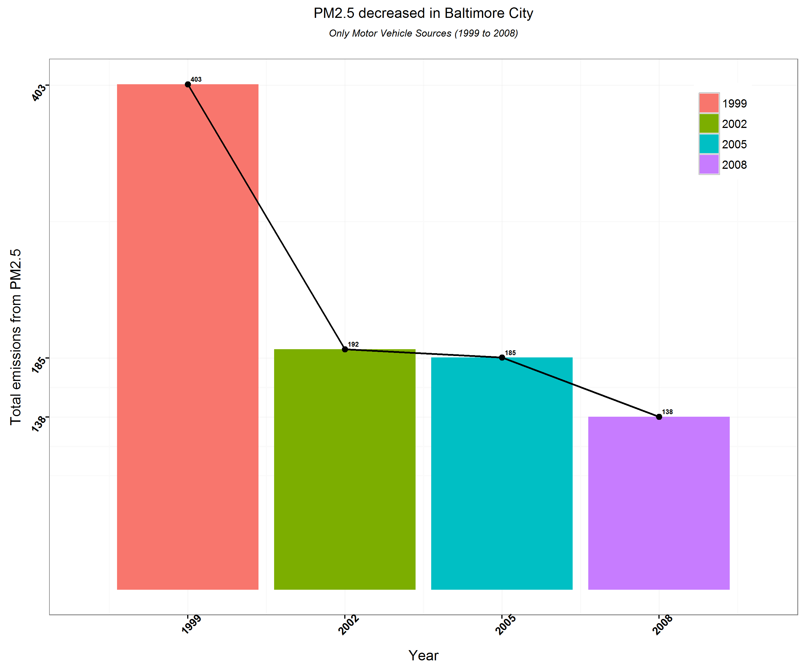
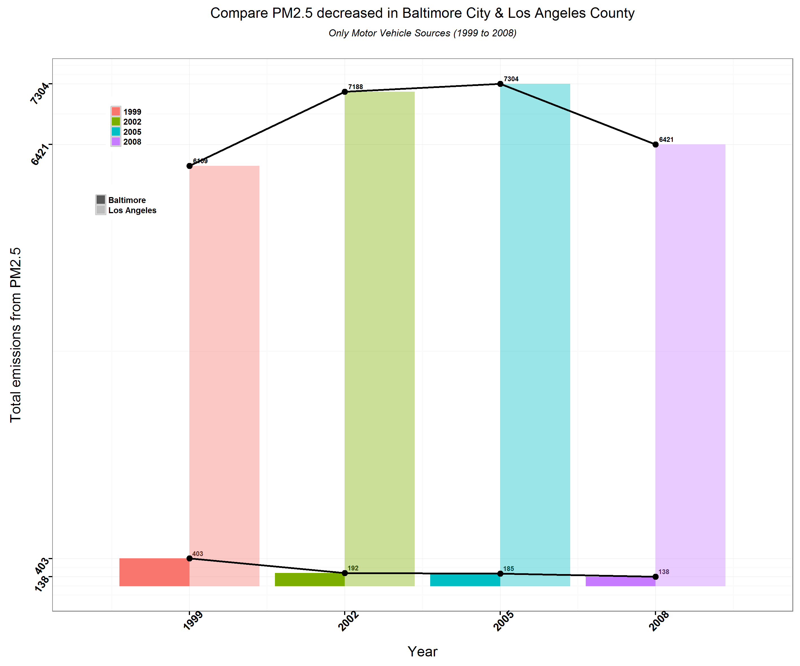

# Introduction

Fine particulate matter (PM2.5) is an ambient air pollutant for which there is strong evidence that it is harmful to human health. In the United States, the Environmental Protection Agency (EPA) is tasked with setting national ambient air quality standards for fine PM and for tracking the emissions of this pollutant into the atmosphere. Approximatly every 3 years, the EPA releases its database on emissions of PM2.5. This database is known as the National Emissions Inventory (NEI). You can read more information about the NEI at the EPA National Emissions Inventory web site.

##Data

The data for this assignment are available from the course web site as a single zip file:

https://d396qusza40orc.cloudfront.net/exdata%2Fdata%2FNEI_data.zip

The zip file contains two files: 

* PM2.5 Emissions Data (summarySCC_PM25.rds): This file contains a data frame with all of the PM2.5 emissions data for 1999, 2002, 2005, and 2008. For each year, the table contains number of tons of PM2.5 emitted from a specific type of source for the entire year. Here are the first few rows.

* Source Classification Code Table (Source_Classification_Code.rds): This table provides a mapping from the SCC digit strings in the Emissions table to the actual name of the PM2.5 source. The sources are categorized in a few different ways from more general to more specific and you may choose to explore whatever categories you think are most useful. For example, source “10100101” is known as “Ext Comb /Electric Gen /Anthracite Coal /Pulverized Coal”.


###A (Plot1)

####Analysis
Have total emissions from PM2.5 decreased in the United States from 1999 to 2008? Using the base plotting system, make a plot showing the total PM2.5 emission from all sources for each of the years 1999, 2002, 2005, and 2008.

####Data Selection Method

with(NIE, tapply(Emissions, year, sum, na.rm = T))  - where NIE is Data Frame loaded from summarySCC_PM25.rds


####The Plot1 script (plot1.R) does the following:

1. Download and unzip data to the Current Working Directory
2. Load data using readRDS(): 
	* PM2.5 Emissions Data (summarySCC_PM25.rds) to NEI 
	* Source Classification Code Table (Source_Classification_Code.rds) to SCC
3. Extracts the total emissions from PM2.5 decreased in the United States from 1999 to 2008.
4. Using the base plotting system, make a plot showing the total PM2.5 emission from all sources for each of the years 1999, 2002, 2005, and 2008
5. Save the plot to plot1.png

#### Running the script
To run the script, source `plot1.R`. After running, you will see the following output as the script works:
```
[Wed Feb 24 22:28:05 2016 ] Exploratory Data Analysis Project.
[Wed Feb 24 22:28:05 2016 ] Assignment: Course Project 2
[Wed Feb 24 22:28:05 2016 ] Author: Samarjit Roy.
[Wed Feb 24 22:28:05 2016 ] 
[Wed Feb 24 22:28:05 2016 ] if current directory does not have data subdir, create one...completed.
[Wed Feb 24 22:28:05 2016 ] download zip file from the source...completed.
[Wed Feb 24 22:28:05 2016 ] if zip file exists, unzip with overwrite..completed.
[Wed Feb 24 22:28:05 2016 ] Load  PM2.5 Emissions Data : summarySCC_PM25.rds .....completed.
[Wed Feb 24 22:28:23 2016 ] Load  Source Classification Code Table : Source_Classification_Code.rds .....completed.
[Wed Feb 24 22:28:25 2016 ] Ploting for PM2.5 decreased in the United States (1999 to 2008) on device(plot1.png): 2 ...completed.
```


#### R CODE to produce plot1.png
<a href="plot1.R">Click here to view <b>Code plot1.R</b></a>


###B (Plot2)

####Analysis

Have total emissions from PM2.5 decreased in the Baltimore City, Maryland (fips == "24510") from 1999 to 2008? Use the base plotting system to make a plot answering this question.

####Data Selection Method
1. subset(NIE,fips == "24510")  - where NIE is Data Frame loaded from summarySCC_PM25.rds
2. with(BaltimoreCityDF , tapply(Emissions, year, sum, na.rm = T)) - Where BaltimoreCityDF is the output from 1.


####The Plot2 script (plot2.R) does the following:

1. Download and unzip data to the Current Working Directory
2. Load data using readRDS(): 
	* PM2.5 Emissions Data (summarySCC_PM25.rds) to NEI 
	* Source Classification Code Table (Source_Classification_Code.rds) to SCC
3. Extracts the total emissions from PM2.5 decreased in the Baltimore City, Maryland (fips == "24510") from 1999 to 2008. 
4. Using the base plotting system, make a plot showing the total PM2.5 emission from all sources for each of the years 1999, 2002, 2005, and 2008
5. Save the plot to plot2.png

#### Running the script
To run the script, source `plot2.R`. After running, you will see the following output as the script works:
```
[Thu Feb 25 17:43:36 2016 ] Exploratory Data Analysis Project.
[Thu Feb 25 17:43:36 2016 ] Assignment: Course Project 2
[Thu Feb 25 17:43:36 2016 ] Author: Samarjit Roy.
[Thu Feb 25 17:43:36 2016 ] 
[Thu Feb 25 17:43:36 2016 ] if current directory does not have data subdir, create one...completed.
[Thu Feb 25 17:43:36 2016 ] download zip file from the source...completed.
[Thu Feb 25 17:43:36 2016 ] if zip file exists, unzip with overwrite..completed.
[Thu Feb 25 17:43:36 2016 ] Load  PM2.5 Emissions Data : summarySCC_PM25.rds .....completed.
[Thu Feb 25 17:44:01 2016 ] Load  Source Classification Code Table : Source_Classification_Code.rds .....completed.
[Thu Feb 25 17:44:02 2016 ] Ploting for PM2.5 decreased in the Baltimore City, Maryland (1999 to 2008) on device(plot2.png): 2 ...completed.

```


#### R CODE to produce plot2.png
<a href="plot2.R">Click here to view <b>Code plot2.R</b></a>


###C (Plot3)

####Analysis

Have total emissions from PM2.5 decreased in the Baltimore City, Maryland (fips == "24510") from 1999 to 2008? Use the base plotting system to make a plot answering this question.

####Data Selection Method
1. group_by(subset(NIE,fips == "24510"),type,year)  - where NIE is Data Frame loaded from summarySCC_PM25.rds
2. summarise(grouped, total=sum(Emissions)) - Where grouped is the output from 1.


####The Plot3 script (plot3.R) does the following:

1. Download and unzip data to the Current Working Directory
2. Load data using readRDS(): 
	* PM2.5 Emissions Data (summarySCC_PM25.rds) to NEI 
	* Source Classification Code Table (Source_Classification_Code.rds) to SCC
3. Extracts the four types of sources indicated by the type (point, nonpoint, onroad, nonroad) variable, which of these four sources have seen decreases in emissions from 1999–2008 for Baltimore City.
4. Using the base plotting system, make a plot showing the total PM2.5 emission from all sources for each of the years 1999, 2002, 2005, and 2008
5. Save the plot to plot3.png

#### Running the script
To run the script, source `plot2.R`. After running, you will see the following output as the script works:
```
[Thu Feb 25 17:00:28 2016 ] Exploratory Data Analysis Project.
[Thu Feb 25 17:00:28 2016 ] Assignment: Course Project 2
[Thu Feb 25 17:00:28 2016 ] Author: Samarjit Roy.
[Thu Feb 25 17:00:28 2016 ] 
[Thu Feb 25 17:00:28 2016 ] if current directory does not have data subdir, create one...completed.
[Thu Feb 25 17:00:28 2016 ] download zip file from the source...completed.
[Thu Feb 25 17:00:28 2016 ] if zip file exists, unzip with overwrite..completed.
[Thu Feb 25 17:00:28 2016 ] Load  PM2.5 Emissions Data : summarySCC_PM25.rds .....completed.
[Thu Feb 25 17:00:53 2016 ] Load  Source Classification Code Table : Source_Classification_Code.rds .....completed.
[Thu Feb 25 17:00:54 2016 ] Ploting for Baltimore City Emissions Status for Four Sources from 1999–2008 on device(plot3.png)...completed.

```



#### R CODE to produce plot3.png
<a href="plot3.R">Click here to view <b>Code plot3.R</b></a>


###D (Plot4)

####Analysis

Across the United States, how have emissions from coal combustion-related sources changed from 1999–2008?

####Data Selection Method
1. coalSCCdata <- subset(SCC, SCC.Level.Three %like% "Coal", select=c("SCC","Short.Name")) - Where SCC is Data frame loaded from Source_Classification_Code.rds
2. coalSCC <- coalSCCdata$SCC
3. coalNIEdata <- subset(NIE, SCC %in% coalSCC) - where NIE is Data Frame loaded from summarySCC_PM25.rds

####The Plot4 script (plot4.R) does the following:

1. Download and unzip data to the Current Working Directory
2. Load data using readRDS(): 
	* PM2.5 Emissions Data (summarySCC_PM25.rds) to NEI 
	* Source Classification Code Table (Source_Classification_Code.rds) to SCC
3. Extracts across the United States, how have emissions from coal combustion-related sources changed from 1999–2008. 
4. Using the base plotting system, make a plot showing the total PM2.5 emission from all sources for each of the years 1999, 2002, 2005, and 2008
5. Save the plot to plot4.png

#### Running the script
To run the script, source `plot4.R`. After running, you will see the following output as the script works:
```
[Thu Feb 25 17:30:18 2016 ] Exploratory Data Analysis Project.
[Thu Feb 25 17:30:18 2016 ] Assignment: Course Project 2
[Thu Feb 25 17:30:18 2016 ] Author: Samarjit Roy.
[Thu Feb 25 17:30:18 2016 ] 
[Thu Feb 25 17:30:18 2016 ] if current directory does not have data subdir, create one...completed.
[Thu Feb 25 17:30:18 2016 ] download zip file from the source...completed.
[Thu Feb 25 17:30:18 2016 ] if zip file exists, unzip with overwrite..completed.
[Thu Feb 25 17:30:18 2016 ] Load  PM2.5 Emissions Data : summarySCC_PM25.rds .....completed.
[Thu Feb 25 17:30:43 2016 ] Load  Source Classification Code Table : Source_Classification_Code.rds .....completed.
[Thu Feb 25 17:30:44 2016 ] Ploting for Coal combustion-related sources PM2.5 decreased in the United States on device(plot4.png)...completed.

```



#### R CODE to produce plot4.png
<a href="plot4.R">Click here to view <b>Code plot4.R</b></a>


###E (Plot5)

####Analysis

Have total emissions from PM2.5 decreased in the Baltimore City, Maryland (fips == "24510") from 1999 to 2008? Use the base plotting system to make a plot answering this question.

####Data Selection Method
1. vehicleSCCdata <- subset(SCC, SCC.Level.One %like% "Mobile" & SCC.Level.Two %like% "Vehicle", select=c("SCC","Short.Name","EI.Sector")) - Where SCC is Data frame loaded from Source_Classification_Code.rds
2. vehicleSCC <- vehicleSCCdata$SCC
3. vehicleNIEdata <- subset(NIE, SCC %in% vehicleSCC & fips == "24510") - where NIE is Data Frame loaded from summarySCC_PM25.rds
4. grouped <- group_by(vehicleNIEdata ,year)
5. emissions <- summarise(grouped, total=sum(Emissions))

####The Plot5 script (plot5.R) does the following:

1. Download and unzip data to the Current Working Directory
2. Load data using readRDS(): 
	* PM2.5 Emissions Data (summarySCC_PM25.rds) to NEI 
	* Source Classification Code Table (Source_Classification_Code.rds) to SCC
3. Extracts the emissions from motor vehicle sources changed from 1999–2008 in Baltimore City
4. Using the base plotting system, make a plot showing the total PM2.5 emission from all sources for each of the years 1999, 2002, 2005, and 2008
5. Save the plot to plot5.png

#### Running the script
To run the script, source `plot5.R`. After running, you will see the following output as the script works:
```
[Thu Feb 25 17:32:37 2016 ] Exploratory Data Analysis Project.
[Thu Feb 25 17:32:38 2016 ] Assignment: Course Project 2
[Thu Feb 25 17:32:38 2016 ] Author: Samarjit Roy.
[Thu Feb 25 17:32:38 2016 ] 
[Thu Feb 25 17:32:38 2016 ] if current directory does not have data subdir, create one...completed.
[Thu Feb 25 17:32:38 2016 ] download zip file from the source...completed.
[Thu Feb 25 17:32:38 2016 ] if zip file exists, unzip with overwrite..completed.
[Thu Feb 25 17:32:38 2016 ] Load  PM2.5 Emissions Data : summarySCC_PM25.rds .....completed.
[Thu Feb 25 17:33:03 2016 ] Load  Source Classification Code Table : Source_Classification_Code.rds .....completed.
[Thu Feb 25 17:33:05 2016 ] Ploting for Motor Vehicle Sources PM2.5 decreased in Baltimore City on device(plot5.png)...completed.

```



#### R CODE to produce plot5.png
<a href="plot5.R">Click here to view <b>Code plot5.R</b></a>


###F (Plot6)

####Analysis

Have total emissions from PM2.5 decreased in the Baltimore City, Maryland (fips == "24510") from 1999 to 2008? Use the base plotting system to make a plot answering this question.

####Data Selection Method
1. vehicleSCCdata <- subset(SCC, SCC.Level.One %like% "Mobile" & SCC.Level.Two %like% "Vehicle", select=c("SCC","Short.Name","EI.Sector")) - Where SCC is Data frame loaded from Source_Classification_Code.rds
2. vehicleSCC <- vehicleSCCdata$SCC
3. vehicleNIEdata <- subset(NIE, SCC %in% vehicleSCC & fips %in% c("24510","06037")) - where NIE is Data Frame loaded from summarySCC_PM25.rds
5. grouped <- group_by(vehicleNIEdata , fips, year)
6. emissions <- summarise(grouped, total=sum(Emissions))
7. emissions$City <- sapply(emissions$fips,switch, "24510"="Baltimore","06037"="Los Angeles")

####The Plot6 script (plot6.R) does the following:

1. Download and unzip data to the Current Working Directory
2. Load data using readRDS(): 
	* PM2.5 Emissions Data (summarySCC_PM25.rds) to NEI 
	* Source Classification Code Table (Source_Classification_Code.rds) to SCC
3. Extracts the compare emissions data from motor vehicle sources in Baltimore City with emissions from motor vehicle sources in Los Angeles County, California (fips == "06037")..
4. Using the base plotting system, make a plot showing the total PM2.5 emission from all sources for each of the years 1999, 2002, 2005, and 2008
5. Save the plot to plot6.png

#### Running the script
To run the script, source `plot6.R`. After running, you will see the following output as the script works:
```
[Thu Feb 25 17:35:18 2016 ] Exploratory Data Analysis Project.
[Thu Feb 25 17:35:18 2016 ] Assignment: Course Project 2
[Thu Feb 25 17:35:18 2016 ] Author: Samarjit Roy.
[Thu Feb 25 17:35:18 2016 ] 
[Thu Feb 25 17:35:18 2016 ] if current directory does not have data subdir, create one...completed.
[Thu Feb 25 17:35:18 2016 ] download zip file from the source...completed.
[Thu Feb 25 17:35:18 2016 ] if zip file exists, unzip with overwrite..completed.
[Thu Feb 25 17:35:18 2016 ] Load  PM2.5 Emissions Data : summarySCC_PM25.rds .....completed.
[Thu Feb 25 17:35:43 2016 ] Load  Source Classification Code Table : Source_Classification_Code.rds .....completed.
[Thu Feb 25 17:35:45 2016 ] Ploting for Motor Vehicle Sources Compare PM2.5 decreased in Baltimore City & Los Angeles County on device(plot6.png)...completed.

```



#### R CODE to produce plot6.png
<a href="plot6.R">Click here to view <b>Code plot6.R</b></a>


